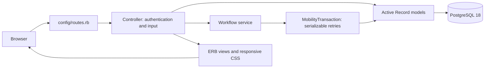

# How the MVC application is organized

The browser sends a request to a route. A controller authenticates the user, checks the required permission and accepts only permitted parameters. Models query PostgreSQL; multi-record changes go through a service inside a serializable transaction. ERB views render the result as HTML.

## Models — data and relationships

`app/models` explicitly maps the `mobility_exchange` schema. `MobilityRecord` assigns UUID strings to opaque text IDs; composite primary keys are declared for join tables. `User#allowed?` evaluates database roles and expiring permission grants. `CatalogItem` is read-only and maps the public equipment view.

`Equipment`, `EquipmentRequest`, `IntakeSubmission`, `Reservation`, `VolunteerShift`, and legal-record models represent the domain. PostgreSQL enforces status transitions, foreign-key identity matches, reservation exclusivity, appointment/shift capacity and immutable evidence. The Rails models add associations and form validation.

All business writes must run inside `MobilityTransaction.call` or `Workflow.run`. The wrapper retries the complete operation for serialization/deadlock failures, including all reads that informed the writes. Never nest it inside another transaction. Do not send email or perform irreversible external actions in a retried block.

## Controllers — request handling

Public catalog and page controllers are anonymous. Account, donation, request and shift controllers require verified sign-in. Record lookups for public users are scoped by ownership; IDs submitted by a browser do not confer access.

`Staff::BaseController` gates the staff area. Each controller additionally checks its action-specific permission, and services recheck permissions within transactions. Models for unimplemented features do not expose automatic CRUD endpoints.

## Views — presentation

`app/views` contains server-rendered ERB forms and pages. Public and operations layouts share reusable design partials, while the operations layout provides desktop and mobile workspace navigation. `public/app.css` supplies responsive grids, mobile stacking, visible keyboard focus and readable form controls. Forms work without JavaScript. Rails escapes user text; public content currently renders as plain text even though the inherited column is named `body_markdown`.

## Services — multi-record workflows

| Service | Responsibility |
| --- | --- |
| `Signup`, `Authentication`, `AccountTokens` | Account setup, password validation, expiring verification/reset tokens |
| `SubmitDonation`, `SubmitRequest` | Contact profile and submission creation |
| `ProcessEquipment` | Validated status changes with processing evidence |
| `ReserveEquipment` | Approved-request reservations; database updates inventory status |
| `BookAppointment` | Ownership, approval, signature and location validation before booking |
| `SignDocument`, `PrivateEvidence` | Exact legal version, electronic signature, generated PDF and private files |
| `ReleaseEquipment` | Distribution linked to reservation, waiver, appointment and pickup evidence |
| `NotificationDelivery` | Outbox claim, email delivery outside the transaction, retry bookkeeping |
| `Audit` | Append-only action records for the implemented workflows |

## Database migrations

The first migration embeds the original 48-table PostgreSQL 18 schema. The second adds `credentials` and `login_sessions`. The committed SQL structure dump preserves PostgreSQL-specific functions, views and triggers; reference rows and baseline ACLs are restored by `db:seed` after structure loading.

Fresh migrations and structure loading are different installation paths. Always seed a structure-loaded database. Do not change this application's schema to `schema.rb`, which cannot represent all of the required SQL objects.
